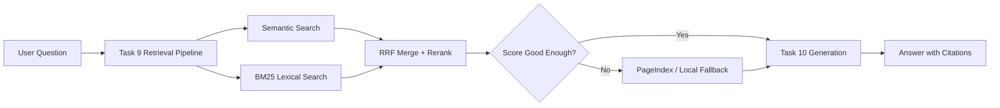

# Group Project - Vietnamese Drug Law RAG

## Summary

This group project builds both required deliverables:

- A Streamlit RAG chatbot for Vietnamese drug-law and related artist-news questions.
- A RAG evaluation pipeline using the completed personal pipeline as the system under test.

The system reuses the individual Tasks 1-10 pipeline:



## Chatbot Demo

Run:

```bash
python -m streamlit run app.py
```

Features:

- Chat interface with conversation memory.
- Answers with citations from Task 10.
- Expandable source chunks with score, document filename, retrieval mode, and metadata.
- Sidebar controls for `top_k`, fallback threshold, reranking, and memory turns.

Example questions:

- `Luật Phòng, chống ma túy 2021 quy định những hình thức cai nghiện nào?`
- `Diễn viên Hữu Tín bị đề nghị truy tố về hành vi gì?`
- `Hôm nay có nghệ sĩ Việt Nam nào mới bị bắt vì ma túy không?`

## Evaluation Pipeline

Run:

```bash
python group_project/evaluation/eval_pipeline.py
```

Outputs:

- `group_project/evaluation/results.md`
- `group_project/evaluation/eval_details.json`

The evaluator uses the required four metrics:

- Faithfulness
- Answer relevance
- Context recall
- Context precision

It compares two configs:

- **Config A:** hybrid search + reranking.
- **Config B:** hybrid search without reranking.

DeepEval is the selected framework for the report. If DeepEval is not installed
or judge-model configuration fails, the script uses a deterministic fallback
scorer with the same four metric names so the pipeline still runs locally.

Optional full LLM generation during evaluation:

```bash
python group_project/evaluation/eval_pipeline.py --use-llm
```

## Bonus Probes

Run:

```bash
python group_project/evaluation/eval_pipeline.py --bonus
```

Documentation:

- `group_project/bonus/failure_probes.md`
- `group_project/bonus/bonus_results.md`

The four probes test missing criminal-code detail, unsupported rumors, missing
final court outcomes, and current-news questions outside the static corpus.

## Environment

Required for full demo quality:

```env
GEMINI_API_KEY=...
GEMINI_MODEL=gemini-2.5-flash
JINA_API_KEY=...
PAGEINDEX_API_KEY=...
WEAVIATE_URL=...
WEAVIATE_API_KEY=...
EMBEDDING_MODEL=AITeamVN/Vietnamese_Embedding
USE_SENTENCE_TRANSFORMERS=true
```

The code keeps local fallbacks for missing external services.

## Team Work Allocation

| Member | MSSV | Responsibility | Status |
|---|---|---|---|
| Nguyễn Thành Đạt | 2A202600944 | Individual RAG pipeline Tasks 1-10 and data preparation | Complete |
| Mai Văn Thuyên | 2A202600926 | Retrieval integration, reranking, and fallback validation | Complete |
| Nguyễn Tài Khoa | 2A202600682 | Streamlit chatbot integration and bonus failure probes | Complete |
| Nguyễn Khởi Lâm | 2A202600607 | Evaluation dataset, A/B evaluation, and final report | Complete |

## Validation

Personal task tests:

```bash
python -m pytest tests/ -v
```

Group smoke checks:

```bash
python group_project/evaluation/eval_pipeline.py --limit 2
python group_project/evaluation/eval_pipeline.py --bonus
python -m streamlit run app.py
```